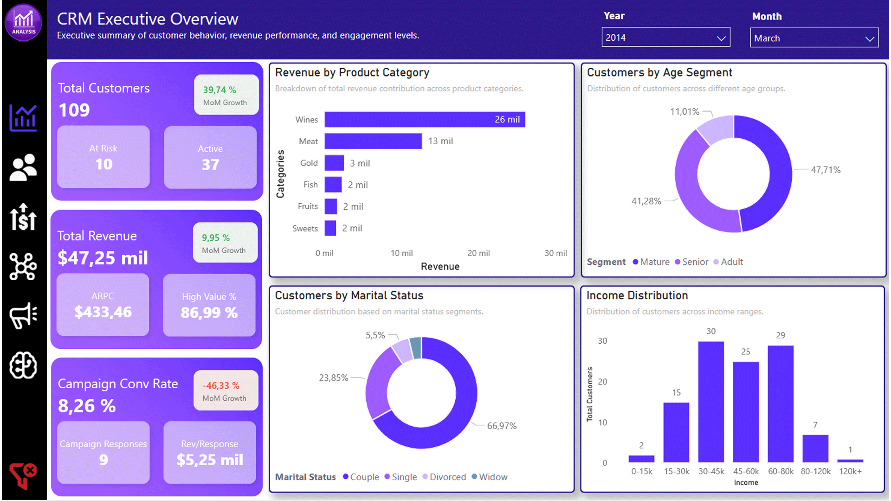
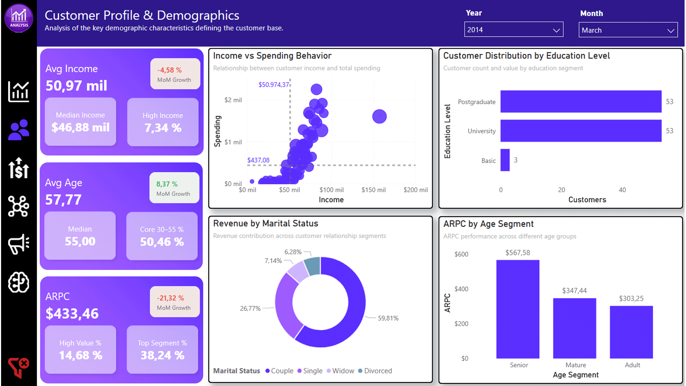
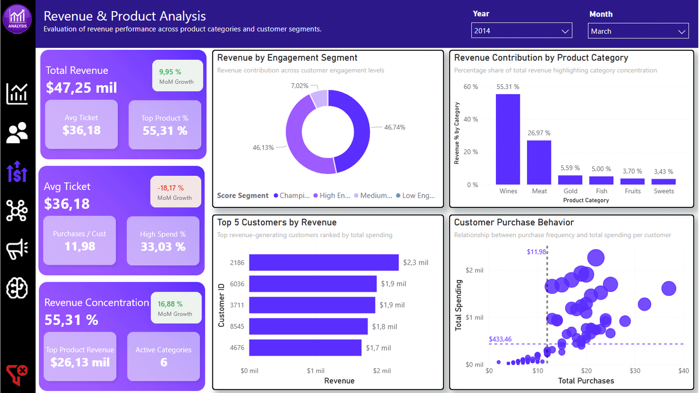
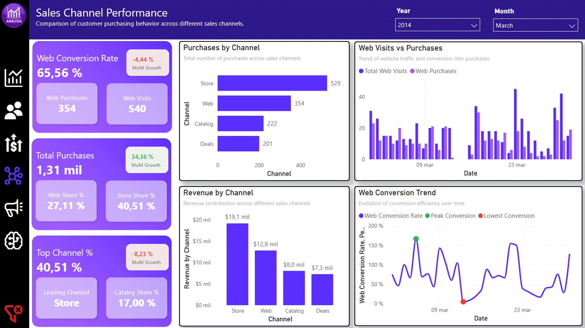
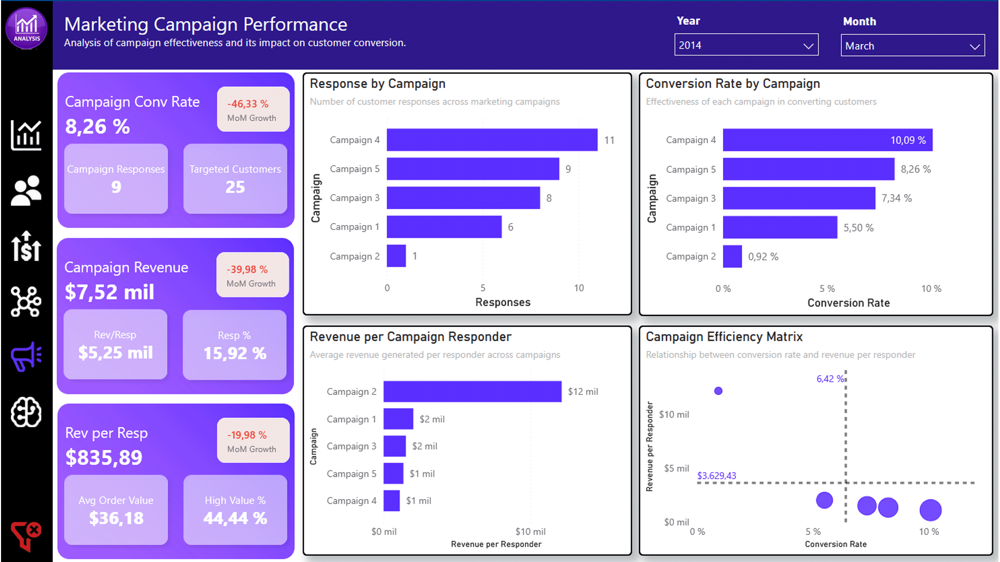
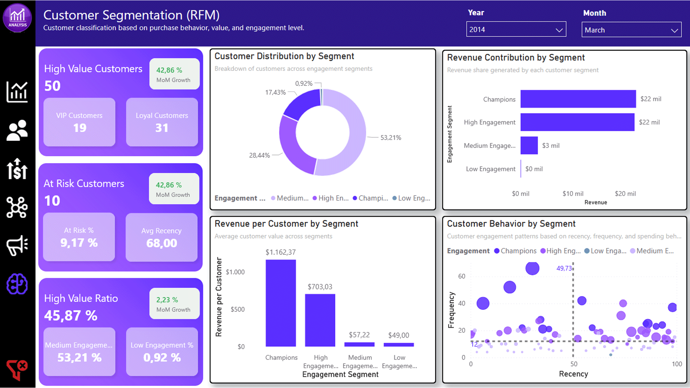

# 📊 CRM & Customer Experience Analytics

End-to-end **Customer Analytics & CRM Intelligence dashboard** built in Power BI, focused on understanding customer behavior, marketing performance, and revenue drivers.

This project transforms raw customer data into **actionable business insights** through data modeling, DAX measures, and interactive dashboards.

---

# 🎯 Project Objectives

This project answers key business questions such as:

- Which customer segments generate the highest revenue?
- Which marketing campaigns are most effective?
- How do customers behave across different sales channels?
- What factors drive customer value and engagement?
- Where are the biggest opportunities for growth and retention?

---

# 🗂 Dataset

**Customer Personality Analysis**  
Source:  
https://www.kaggle.com/datasets/imakash3011/customer-personality-analysis

The dataset includes:

- Customer demographics (age, income, education, marital status)
- Purchase behavior across product categories
- Marketing campaign interactions (AcceptedCmp1–5, Response)
- Channel activity (Web, Store, Catalog, Deals)
- Recency, frequency, and spending metrics

---

# 🧱 Technologies Used

- **Power BI** (Data Visualization & Dashboarding)
- **DAX** (Advanced calculations & KPIs)
- **Data Modeling** (Star schema + disconnected tables)
- **DAX Studio** (Measure extraction & documentation)
- **Git & GitHub** (Version control & portfolio)

---

# 🧠 Data Model Highlights

- Fact table: `FactCustomerMetrics`
- Dimension tables: `DimCustomer`, `DimDate`, `DimAgeGroup`, `DimEducation`, `DimMarital`
- Use of **disconnected tables** for:
  - Channel analysis
  - Campaign performance
  - Product Category
- Custom measures for:
  - Time intelligence (MoM growth, variance)
  - Dynamic segmentation
  - Conversion funnels
  - Behavioral analytics (RFM)

---

# 📊 Key Metrics

## 👥 Customer Metrics
- Total Customers
- Avg Customer Income / Age
- High Value Customers (RFM)
- Active vs At Risk Customers
- Customer Growth %

## 💰 Revenue Metrics
- Total Revenue
- Avg Purchase Value (Avg Ticket)
- Revenue per Customer (ARPC)
- Revenue Concentration %
- Revenue by Category

## 📢 Marketing Metrics
- Campaign Conversion Rate
- Campaign Responses
- Revenue from Responders
- Revenue per Responder
- Campaign Efficiency

## 🛒 Channel Metrics
- Purchases by Channel
- Revenue by Channel
- Channel Share %
- Web Conversion Rate

## 🔁 Behavioral Metrics
- Recency, Frequency, Monetary (RFM)
- Customer Segmentation (Champions, Loyal, At Risk, etc.)
- Engagement distribution

---

# 📊 Dashboard Structure

The report is structured into **6 analytical pages**, each designed to answer specific business questions:

---

## 📌 1. CRM Executive Overview

High-level business summary including:
- Total customers and revenue
- Customer distribution
- Revenue by category
- Campaign performance snapshot

---

## 👥 2. Customer Profile & Demographics

Customer composition analysis:
- Income vs Spending behavior
- Education level distribution
- Revenue by marital status
- ARPC by age segment

---

## 💰 3. Revenue & Product Analysis

Revenue deep dive:
- Revenue by product category
- Revenue concentration
- Top customers
- Purchase behavior patterns

---

## 🛒 4. Sales Channel Performance

Channel efficiency and usage:
- Purchases & revenue by channel
- Channel share analysis
- Web conversion funnel
- Conversion trend with peak/low detection

---

## 📢 5. Marketing Campaign Performance

Campaign effectiveness analysis:
- Response by campaign
- Conversion rate by campaign
- Revenue per responder
- Campaign efficiency matrix (conversion vs revenue)

---

## 🧠 6. Customer Segmentation (RFM)

Advanced customer segmentation:
- Distribution by engagement segment
- Revenue contribution by segment
- Revenue per customer by segment
- Behavioral scatter (Recency vs Frequency vs Revenue)

---

# 📂 Project Structure

crm-customer-experience-analytics

│
├── data

│ ├── raw

│ └── processed

│
├── dashboard

│
├── docs

│ ├── data_dictionary.pdf

│ └── dax_measures.csv

│
├── images

│ ├── report/screenshoots

    │ └── report-screenshots

    │ ├── executive.png

    │ ├── customer-profile.png

    │ ├── revenue-products.png

    │ ├── channels.png

    │ ├── marketing.png

    │ └── rfm.png

  ├── support

    │
└── README.md

---

# 📘 Documentation

The project includes:

- 📄 **Data Dictionary (PDF)**  
  Detailed explanation of all measures, KPIs, and business logic.

- 📊 **DAX Measures Export (CSV)**  
  Full list of measures extracted using DAX Studio.

---

# 🚀 Business Value

This dashboard enables:

- Identification of **high-value customer segments**
- Optimization of **marketing campaign performance**
- Understanding of **channel effectiveness**
- Detection of **customer retention risks**
- Data-driven decision-making for **revenue growth**

---

# 🧑‍💻 About This Project

This project is part of my **Data Analytics & Business Intelligence portfolio**, showcasing:

- Advanced Power BI development
- Business-oriented data modeling
- KPI design and storytelling
- CRM and Marketing Analytics

---

# 👤 About Me

**Juan Manuel Pérez**  
Data Analyst specializing in Power BI, SQL, and Business Intelligence.

🔗 LinkedIn:  
https://www.linkedin.com/in/juan-manuel-p%C3%A9rez-garc%C3%ADa-bigdata/